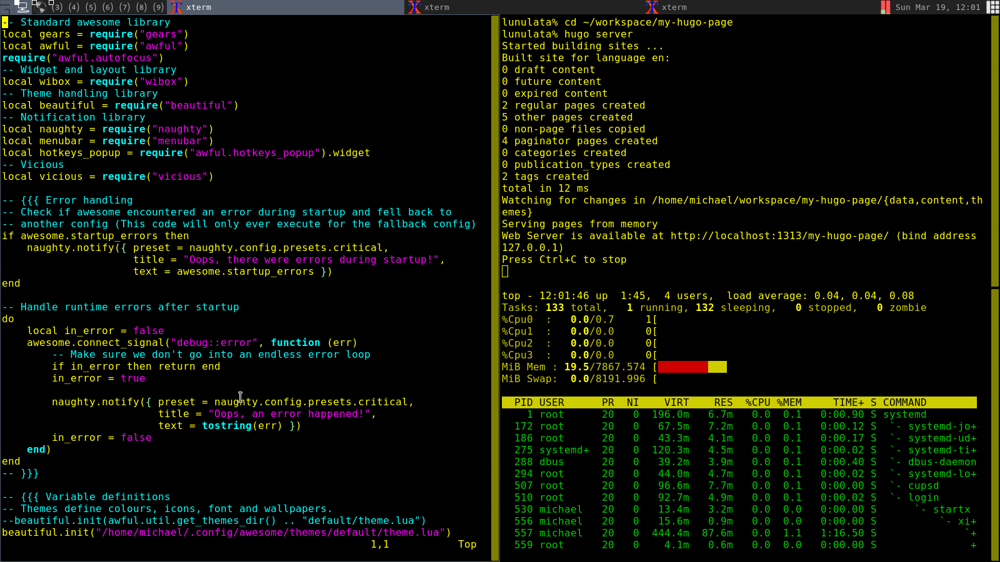

Dependencies
------------

* [awesome](https://awesomewm.org/)
* [vicious](https://github.com/Mic92/vicious) for battery widget.
* [maim](https://github.com/naelstrof/maim) for simple screenshots.

Install
-------
```
git clone git@github.com:kressi/awesome-config.git ~/.config/awesome
```
